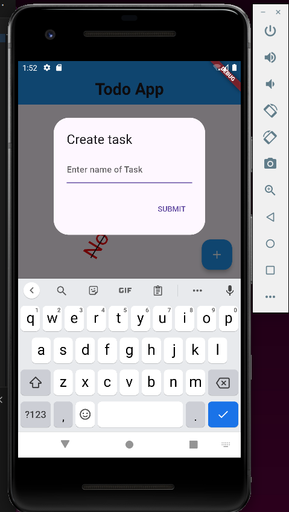

# Simple Todo App


## Overview

Simple Todo App is a basic task management app built using Flutter. It allows users to add, delete, and mark tasks as completed. This the first app that I have created since i have started learning App Devlopment with Flutter. I will keep on adding new features as I keep gaining more experience.

## Features

- Add new tasks
- Delete tasks
- Mark tasks as completed

## Screenshots





## Getting Started

Follow these instructions to get a copy of the project up and running on your local machine for development and testing purposes.

### Prerequisites

- Flutter SDK: [Install Flutter](https://flutter.dev/docs/get-started/install)
- Dart SDK (comes with Flutter)
- Android Studio or Visual Studio Code (recommended for Flutter development)
- Git

### Installation

1. **Clone the repository:**

   ```sh
   git clone https://github.com/YourUsername/SimpleTodoApp_with_flutter.git
   cd SimpleTodoApp_with_flutter/todo_app/

2. **Install Dependencies:**
   
    ```sh
    flutter pub get

4. **Run the app**

   ```sh
   flutter run
